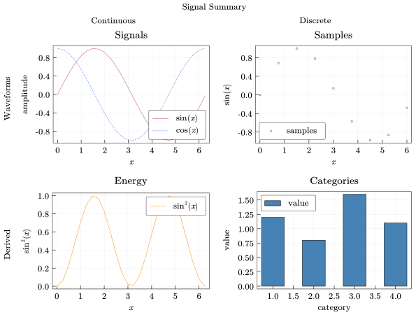

# QuickPlots.jl

`QuickPlots.jl` is a lightweight Julia package for chart-oriented plotting with Cairo output.

It focuses on a compact set of figure-building tools: `Chart` for single plots, `ChartGrid` for composed layouts, and supporting types for colors, legends, annotations, and math-aware text rendering.



## Installation

Until `QuickPlots.jl` is registered, install it directly from the GitHub repository:

```julia
using Pkg
Pkg.add(url="https://github.com/NumericalForge/QuickPlots.jl")
```

## Quick Start

```julia
using QuickPlots

x = collect(0:0.2:2π)
chart = Chart(
    size = (10cm, 7cm),
    title = "Trigonometric Curves",
    xlabel = "`x`",
    ylabel = "`y`",
    legend = :bottom_right,
)

add_line(chart, x, sin.(x); label = "`sin(x)`", mark = :circle)
add_line(chart, x, cos.(x); label = "`cos(x)`", color = :royalblue)

save(chart, "chart.svg", "chart.pdf")
```

## Documentation

Build the docs locally with:

```julia
using Pkg
Pkg.activate("docs")
Pkg.instantiate()
include("docs/make.jl")
```

## License

This project is licensed under the MIT License. See [LICENSE.md](LICENSE.md) for details.
